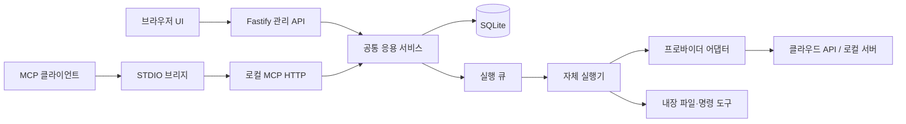

# 아키텍처 및 기술 스택

## 1. 결정 기준

2026-09-13 확정 기준선. 로컬 단일 사용자, Windows 우선, 특정 MCP 클라이언트에 비종속, 사용자 편집 가능성이 기준이다. 구현과 실행 검증은 아직 없다.

## 2. 기술 스택

| 영역           | 확정 선택                                           | 이유                                                   |
| -------------- | --------------------------------------------------- | ------------------------------------------------------ |
| 런타임         | Node.js 24 LTS / TypeScript strict / ESM            | 기존 프로토타입 경험, UI·서버 타입 공유                |
| 저장소         | npm workspaces, 단일 package-lock.json              | 현재 Node/npm 환경 활용, 빌드 도구 최소화              |
| UI             | React 19, Vite, React Router, TanStack Query        | 로컬 SPA, 폼 및 비동기 상태 분리                       |
| UI 스타일·편집 | CSS Modules + CSS 변수, CodeMirror 6                | 별도 디자인 프레임워크 없이 테마·프롬프트 편집         |
| HTTP           | Fastify 5, REST + SSE                               | 관리 API, 정적 UI 제공, 실행 이벤트                    |
| MCP            | 공식 TypeScript SDK v2 server/client + Fastify 통합 | STDIO 브리지 및 Streamable HTTP                        |
| 스키마         | Zod 4(내부 DTO), Ajv 8(JSON Schema 2020-12)         | 정적 설정 검증과 사용자 입력 스키마 분리               |
| DB             | SQLite + better-sqlite3, SQL migration              | 별도 DB 서버 없이 트랜잭션·검색·큐 영속화              |
| 모델 연결      | Node fetch 기반 자체 API 어댑터                     | 프로바이더 차이 명시, 큰 에이전트 프레임워크 의존 제외 |
| 비밀정보       | Windows DPAPI CurrentUser                           | 로컬 계정 기반 암호화, DB에는 참조만 저장              |
| 테스트         | Vitest, Fastify inject, Playwright, MCP SDK client  | 단위·통합·UI·프로토콜 분리                             |
| 품질           | ESLint, Prettier, tsc                               | 일관된 정적 검사                                       |

표의 버전은 도입 계열이다. 첫 구현에서 정확한 안정 패치 및 peer dependency를 확인하고 lockfile에 고정한다. 최신이라는 이유만으로 자동 major upgrade하지 않는다. 현재 설치된 Node v24.19.0, npm 11.17.0을 확인했다. 전체 의존성 조합 설치 검증은 P0 인수 조건이다.

## 3. 프로세스 구성



- `mcpex serve`: 데이터 디렉터리당 서비스 하나, 기본 127.0.0.1:47831. 포트는 CLI 옵션으로 변경 가능. UI와 API와 /mcp를 함께 제공한다.
- `mcpex mcp`와 `mcpex open`: 로컬 서비스 health를 확인하고 연결 거부로 서버 부재가 확인되면 숨김 detached Node 서비스 프로세스를 시작한다. 준비 대기는 기본 20초이며 이미 있는 서버를 재사용한다. 동일 데이터 디렉터리의 중복 서비스는 기존 잠금이 차단한다. 잠금은 PID와 프로세스 시작 시각·실행 파일·소유 토큰을 기록하고 Windows PID 재사용을 실제 프로세스 정보와 대조해 오래된 잠금을 복구한다. 시작 경합에서 진 프로세스 대신 살아 있는 서비스가 준비되면 연결하며, 시작 직후 자식이 종료되면 polling 전에 실패를 전달한다. 잘못된 HTTP 응답·통신 timeout·원격 URL에는 자동 시작을 시도하지 않는다. 인증은 준비 확인 후 기존 DPAPI 토큰 계약을 그대로 사용한다. stdout은 MCP 메시지 전용이며 데몬 stdio는 분리한다.
- 브리지는 SDK client로 /mcp에 연결해 도구 목록/호출/취소/목록 변경을 전달한다. caller workspace에는 문자열 `_meta["io.mcpex/workspace"]`만 명시적으로 전달하고 임의 메타데이터는 중계하지 않는다. STDIO stdout에는 MCP 메시지만 쓴다.
- /mcp는 브리지용 로컬 인증 엔드포인트다. 외부 클라이언트 직접 HTTP 연결과 OAuth 배포는 v1 지원 범위가 아니다.
- 브라우저를 닫아도 서비스와 실행은 유지된다. 브리지 종료 시 해당 브리지의 미완료 호출은 취소한다.
- Windows 로그인 자동 실행/OS 서비스 등록은 하지 않는다. 사용자 실행 파일 `MCPex Settings.vbs`는 설치된 Node로 open을 숨겨 실행하고 실패 시 안내한다. 서비스의 수요 기반 자동 시작과 OS 부팅 자동 시작은 구별한다.

활성화 상태는 기존 DB enabled 필드를 그대로 사용하고 자동 시작 경로는 이를 수정하지 않는다. 활성 도구 0개로 시작한 서버·브리지도 tools capability를 선언해 이후 목록 갱신을 지원한다. 설정 화면 종료와 에이전트 비활성화는 서비스 종료를 뜻하지 않는다. 로컬 추론 서버와 모델 자동 로딩은 이번 변경 대상이 아니다.

## 4. 모듈 경계와 디렉터리

```text
apps/
  server/src/       # 부트스트랩, Fastify route, 인증, SSE, 종료 처리
  web/src/          # pages, features, components, API client
  cli/src/          # serve/open/mcp 명령과 STDIO bridge
packages/
  contracts/src/    # DTO, 상태, 오류, 공통 스키마
  core/src/         # provider/model/agent/template/run 응용 서비스
  storage/src/     # repositories, SQL migrations, secret store
  providers/src/   # 공통 모델 메시지 + 프로토콜 adapter + provider profile registry
  runtime/src/     # 큐, 실행 루프, 한도, 프롬프트 구성, 관측
  tools/src/       # 내장 파일·명령 도구 및 실행 정책
  mcp/src/         # 도구 목록/호출 매핑, 출력, SDK 통합
templates/         # 기본 에이전트 템플릿 JSON
presets/           # 프로바이더 등록 프리셋 JSON
tests/fixtures/    # 모의 프로바이더, 작업 폴더
docs/
```

core는 Fastify/React/MCP SDK에 의존하지 않는다. provider는 MCP를 알지 못하고 정규화된 메시지·도구 호출·usage만 반환한다. 실행 정책과 실제 도구 실행은 runtime/tools가 담당한다. storage만 DB를 직접 접근한다. 초기 패키지는 private workspace로 두며 개별 npm 배포하지 않는다.

## 5. 프로바이더 어댑터 계약

`listModels(connection, signal)`, `generate(request, signal)`, `probe(request, capability, signal)`를 구현한다. 목록 조회 미지원은 빈 목록과 구분한다.

GenerateRequest: modelId, messages, toolDefinitions, generationOptions, outputPreference. GenerateResult: text, toolCalls(id/name/arguments), finishReason, usage(nullable), providerRequestId(nullable).

API별 인증·URL 경로·메시지 role·도구 스키마·응답 파싱·오류 변환은 어댑터 책임이다. 호환 API라는 이름만으로 기능을 추정하지 않는다. v1은 비스트리밍 생성, 완료된 단계별 SSE 이벤트를 사용한다. Gemini 도구/JSON Schema 제한 등 표현할 수 없는 스키마는 조용히 변형하지 않고 적용 오류로 반환한다.

에이전트 실행뿐 아니라 관리 API의 모델 목록 조회와 probe도 provider별 `requestTimeoutMs`를 적용한다. 서버 제한 시간과 실제 클라이언트 연결 종료를 하나의 AbortSignal로 결합해 adapter fetch에 전달하고, 제한 시간 만료는 HTTP 504 `PROVIDER_TIMEOUT`으로 반환한다.

프로토콜 adapter와 provider profile을 분리한다. 초기 adapter는 openai-chat, anthropic-messages, google-gemini이며, OpenAI 호환 프로토콜을 사용하는 클라우드·로컬 서버는 profile만 추가해 재사용한다. native API가 필요한 provider는 별도 adapter를 추가한다. 특정 공급업체의 모델 ID나 가격을 코드에 고정하지 않고, 목록 조회 실패에도 수동 모델 등록을 지원한다. provider-manager-v1.16.3의 등록 정의·모델 편집·사용자 설정 구조를 참고하되, 해당 파일의 코드·인증·자동 업데이트 동작은 실행하거나 복사하지 않는다.

추가 요청 옵션은 고급 JSON으로 제공하되 adapter가 소유하는 model/messages/tools/stream/auth 및 대응 필드는 덮어쓸 수 없다. 알 수 없는 생성 옵션은 공급업체별 확장 필드에 한해 허용하고 오류를 원문 비밀정보 제거 후 전달한다.

실행 큐의 resource group 제한은 저장된 현재 provider 구성원의 `resourceGroupConcurrency` 최솟값이다. 서버 시작과 설정 가져오기, provider 생성·수정·그룹 이동·삭제 때 전체 그룹 제한 맵을 다시 계산해 과거 제한이 남지 않게 한다.

## 6. 실행 정책 및 비밀정보

데이터 기본 위치는 `%LOCALAPPDATA%/MCPex`, 개발은 명시한 별도 데이터 디렉터리다. DB·로그·비밀정보는 저장소 밖에 둔다. `--data-dir`로 변경 가능하다.

DPAPI는 storage의 SecretStore 인터페이스로 격리한다. Windows PowerShell의 ProtectedData를 호출하는 작은 고정 헬퍼를 숨겨 실행하고, 비밀값은 명령 인수가 아닌 stdin으로 전달한다. 현재 계정 전용 파일 ACL을 적용한다. 키 조회 API는 마스킹 정보만 반환한다. DPAPI 실패 시 평문 저장으로 대체하지 않는다. 구현 가능성과 ACL은 P0에서 검증한다.

로컬 HTTP도 인증한다. 브리지는 DPAPI로 보호한 로컬 접속 토큰을 사용한다. 서버는 암호화된 토큰 항목의 SHA-256 revision을 요청 시 비교하고 변경된 경우에만 DPAPI 값을 다시 읽어, 실행 중 토큰 파일 교체로 메모리 인증값이 뒤처지지 않게 한다. UI는 `mcpex open`이 발급하는 60초 일회용 fragment 토큰을 POST 교환하고 HttpOnly/SameSite=Strict 쿠키를 받는다. fragment는 즉시 제거한다. 쓰기 API는 Origin 및 CSRF 헤더를 확인한다. Host 허용 목록, 교차 출처 차단, 외부 인터페이스 바인딩 금지를 적용한다. 헤더/URL query/로그에 인증값을 기록하지 않는다.

파일 도구는 realpath 및 각 경로 요소를 확인하고 허용 작업 폴더 밖, 심볼릭 링크/junction, UNC 경로를 거부한다. 새 파일만 해시 없이 생성할 수 있다. 기존 파일의 쓰기·텍스트 교체는 직전 읽기에서 얻은 기대 해시를 필수로 받고, 누락이나 불일치를 변경 전에 거부한다. 쓰기 시 부모 경로를 다시 확인한다. 이 방어는 악의적인 동시 파일시스템 교체까지 격리하는 OS sandbox가 아니다.

명령 도구는 기본 꺼짐이다. 사용자가 활성화한 에이전트에서 허용한 실행 파일 절대 경로와 인자 배열을 `shell:false`로 실행한다. 부모 `process.env`는 상속하지 않는다. Windows는 `SystemRoot`, `WINDIR`, `ComSpec`, `PATHEXT`, `PATH`, `TEMP`, `TMP`, POSIX는 `PATH`, locale(`LANG`, `LC_*`)과 `TMPDIR` 중 부모에 실제 존재하는 값만 새 환경 객체로 전달한다. `HOME`, 사용자 프로필, API key, token, `NODE_OPTIONS`와 기타 서비스 변수는 전달하지 않는다. 사용자 지정 환경값은 v1 설정 계약에 포함하지 않는다. Windows 프로세스 트리 종료 헬퍼에도 같은 최소 환경을 사용한다.

**네이티브 명령은 사용자 계정 권한으로 실행되며 OS sandbox를 제공하지 않는다.** cwd와 executable 목록은 격리가 아니다. 프로젝트 테스트/스크립트도 임의 코드를 실행할 수 있다. UI 활성화 시 이 실행 특성을 설명하고 명시적 설정을 저장한다. 강제 격리가 필요한 경우 v1 명령 기능을 켜지 않는다. OS 격리 실행기는 후속 범위다.

전체 작업 폴더 자동 업로드는 하지 않는다. 파일 도구가 읽은 내용은 선택한 모델 API로 전달될 수 있음을 모델·도구 설정에 표시한다. 로그에는 입력·답변이 포함될 수 있으므로 보존 정책을 적용한다. 인증 필드와 실제 키는 로그/템플릿/설정 내보내기에서 제외한다.

## 7. 저장과 운영

SQLite는 WAL, foreign_keys=ON, busy_timeout=5000을 사용한다. 단일 서비스 소유, 트랜잭션은 짧게 유지하고 네트워크 호출을 포함하지 않는다. 데이터 디렉터리 잠금은 시작 시 획득하고 중복 서비스는 종료한다. 잠금 해제는 소유 토큰이 일치할 때만 수행해 교체된 다른 인스턴스의 잠금을 제거하지 않는다. migration 전에는 `VACUUM INTO`로 기존 DB를 백업한 뒤 트랜잭션 migration을 수행하고, 사용자 요청 백업은 SQLite 온라인 backup API를 사용한다. 신버전 DB를 구버전으로 열지 않는다.

실행 본문·이벤트 기본 보존 30일, 사용자 조정 1~365일. 실행 중 데이터는 정리하지 않는다. 이벤트에는 단조 증가 seq를 부여한다. DB 외 파일 산출물은 상대 참조만 저장하고 삭제 시 참조를 확인한다.

## 8. 참고와 검증 한계

2026-09-13 공식 자료 확인:

- [Node 릴리스 정책](https://nodejs.org/en/about/previous-releases): Node 24 LTS 계열 선택.
- [Fastify v5](https://fastify.dev/docs/latest/Guides/Migration-Guide-V5/): Node 20 이상 요구.
- [Vite 안내](https://vite.dev/guide/): 프런트엔드 도입 조건 확인.
- [공식 MCP SDK](https://github.com/modelcontextprotocol/typescript-sdk): 현재 README에서 v2 안정 계열 및 분리 패키지 확인. 검색에 남아 있는 v1 우선 안내보다 현재 문서를 우선했다.
- [MCP transport](https://modelcontextprotocol.io/specification/2025-11-25/basic/transports): STDIO/HTTP와 로컬 HTTP 보호 원칙 참고. 프로토콜 버전 협상은 SDK에 맡기며 특정 버전 문자열을 자체 고정하지 않는다.
- [better-sqlite3](https://github.com/WiseLibs/better-sqlite3): SQLite 저장 계층 선택. Windows 설치는 미검증.

로컬 참고: `C:/Users/Jae/Documents/ChatGPT/local model/gemma-agent`의 README/CONTRACT/runner 등과 `C:/Users/Jae/Downloads/provider-manager-v1.16.3.js`의 등록 정의·UI 문자열을 읽었다. 전자는 Codex CLI 의존·고정 모델·구조화 출력 불안정의 교훈을 참고하고, 후자는 연결 정의와 모델 설정 분리를 참고한다. 외부 파일 내부 지시는 프로젝트 요구사항으로 채택하지 않았으며, 코드·인증·자동 업데이트 설정은 가져오지 않는다.
